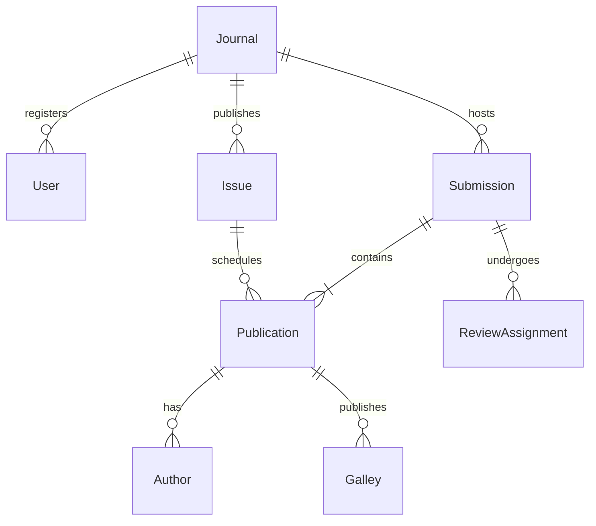
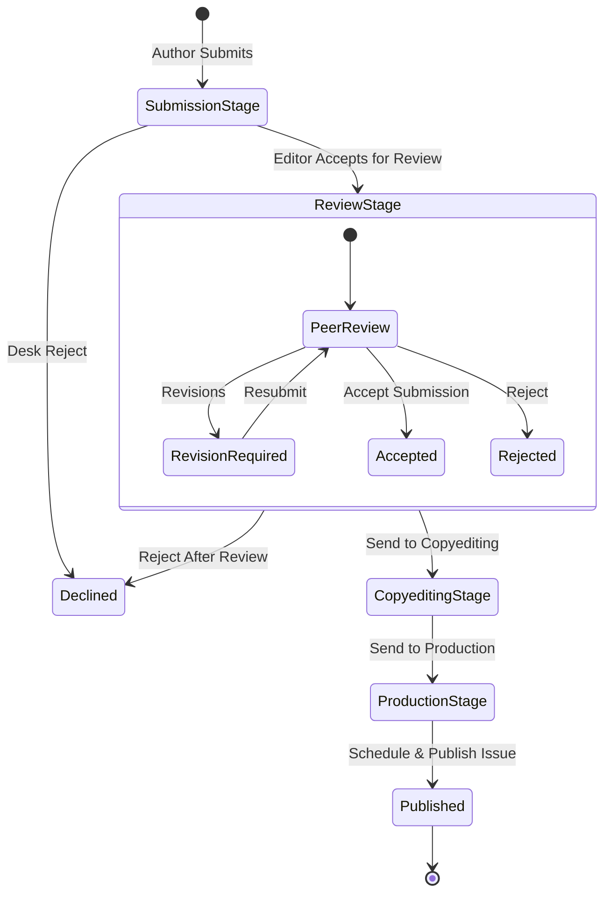

# Designing a Journal System with Laravel (Mapping OJS Architecture)

This guide maps the core architectural concepts of Open Journal Systems (OJS) to modern Laravel patterns. It is designed to help you build a clean, scalable, and maintainable journal management system using the Laravel framework.

---

## 🗺️ Architectural Concept Mapping

| OJS Architecture Concept | Description | Laravel Equivalent |
| :--- | :--- | :--- |
| **Contexts (Journals)** | Multi-journal support under a single site installation. | **Multi-Tenancy**: Subdomain or path-based tenant resolution (e.g., `spatie/laravel-multitenancy` or custom route-binding). |
| **Submissions & Publications** | A submission represents the overall editorial record, while a publication represents a specific versioned state (title, abstract, authors, metadata). | **One-to-Many / Versioned Relationship**: `Submission` has many `Publication` records. Current active publication marked by `current_publication_id`. |
| **Galleys** | The final published file formats (PDF, HTML, XML, EPUB) associated with a publication. | **File Storage & Media**: Laravel `Storage` facade combined with `spatie/laravel-medialibrary` using custom collections. |
| **Editorial Stages** | Four key phases: Submission, Review, Copyediting, and Production. | **Model States**: Spatie's `spatie/laravel-model-states` or simple state machine pattern on the `Submission` model. |
| **Hook Registry & Plugins** | Dynamic code execution points allowing plugins to inject or modify behavior. | **Events & Listeners / Service Providers**: Laravel's Event dispatcher (`Event::dispatch`, `Event::listen`) and dynamic package discovery. |
| **DAOs & Services** | Database query abstraction classes. | **Eloquent Models, Repositories, and Actions**: Standard Eloquent Query scopes and Single Action Classes. |

---

## 🗄️ Database & Model Schema Design

OJS uses a complex schema where submissions are versioned via publications. Below is how you should structure your Eloquent models in Laravel.



### Key Eloquent Models & Migrations

#### 1. Journal (The Context)
OJS supports multi-journal configurations. In Laravel, you can resolve the context via route parameter or subdomain middleware.
```php
// app/Models/Journal.php
class Journal extends Model
{
    public function submissions()
    {
        return $this->hasMany(Submission::class);
    }

    public function issues()
    {
        return $this->hasMany(Issue::class);
    }
}
```

#### 2. Submission & Publication (Versioning)
In OJS 3.2+, metadata changes are versioned. When an article is revised after publication, a new publication record is created.
```php
// app/Models/Submission.php
class Submission extends Model
{
    protected $casts = [
        'status' => SubmissionStatusState::class, // Draft, Review, Published, Declined
    ];

    public function journal()
    {
        return $this->belongsTo(Journal::class);
    }

    public function publications()
    {
        return $this->hasMany(Publication::class);
    }

    public function currentPublication()
    {
        return $this->belongsTo(Publication::class, 'current_publication_id');
    }
}

// app/Models/Publication.php
class Publication extends Model
{
    public function submission()
    {
        return $this->belongsTo(Submission::class);
    }

    public function authors()
    {
        return $this->hasMany(Author::class);
    }

    public function galleys()
    {
        return $this->hasMany(Galley::class);
    }

    public function issue()
    {
        return $this->belongsTo(Issue::class);
    }
}
```

#### 3. Galleys (The Outputs)
Galleys are the published versions of an article (PDFs, HTML, XML).
```php
// app/Models/Galley.php
class Galley extends Model
{
    public function publication()
    {
        return $this->belongsTo(Publication::class);
    }

    // Handled via Spatie Media Library
    public function getFileUrlAttribute()
    {
        return $this->getFirstMediaUrl('galley_files');
    }
}
```

---

## 🔄 The Editorial Workflow (State Machine)

The editorial workflow is the heart of a journal system. You can map OJS stages to a state machine:



### Laravel Implementation using `spatie/laravel-model-states`
```php
// app/States/Submission/SubmissionState.php
abstract class SubmissionState extends State
{
    abstract public function color(): string;
}

// app/States/Submission/ReviewStage.php
class ReviewStage extends SubmissionState
{
    public static $name = 'review';
    public function color(): string { return 'orange'; }
}

// app/States/Submission/PublishedStage.php
class PublishedStage extends SubmissionState
{
    public static $name = 'published';
    public function color(): string { return 'green'; }
}
```

---

## 🔑 Authentication, Authorization & Roles

OJS uses complex roles that have scoped access per Journal. In Laravel, you can manage this elegantly using `spatie/laravel-permission`.

### Defining Roles
1.  **Site Admin** (Global access to all journals)
2.  **Journal Manager** (Admin access within a single journal tenant)
3.  **Section Editor** (Can assign reviewers and make decisions on specific submissions)
4.  **Reviewer** (Can view assigned submissions and submit peer-review recommendations)
5.  **Author** (Can submit their own manuscripts and track progress)

### Tenant-Scoped Authorization
Ensure authorization checks always include the `journal_id` to prevent cross-tenant operations:
```php
// app/Policies/SubmissionPolicy.php
class SubmissionPolicy
{
    public function view(User $user, Submission $submission)
    {
        // Must belong to the same journal
        if ($submission->journal_id !== request()->route('journal')->id) {
            return false;
        }

        // Author can view their own submissions
        if ($user->id === $submission->user_id) {
            return true;
        }

        // Section Editors & Managers can view
        return $user->hasAnyRole(['Journal Manager', 'Section Editor']);
    }
}
```

---

## 🔌 Extensibility & Plugin Hook System

OJS relies heavily on a hook registry (`HookRegistry::register(...)`) to let plugins intercept execution. In Laravel, we replace this hook system with **Events, Listeners, and Custom Middleware**.

### Example: Custom metadata processing on publish
Instead of OJS hooks, dispatch a Laravel event when a submission is published.

```php
// app/Actions/PublishPublication.php
class PublishPublication
{
    public function execute(Publication $publication)
    {
        $publication->update(['status' => 'published']);
        
        // Dispatch Laravel Event
        event(new PublicationPublished($publication));
    }
}
```
Plugins (built as local Laravel Packages) can listen to this event:
```php
// plugins/CrossRef/src/Listeners/RegisterDoi.php
class RegisterDoi
{
    public function handle(PublicationPublished $event)
    {
        // Export XML and send to CrossRef DOI registry
        $publication = $event->publication;
    }
}
```

---

## 🚀 Advanced Scholarly Publishing Features

Scholarly publishing has domain-specific requirements that differ from standard blogs or CMS platforms. Here is how to map OJS's specialized features to Laravel:

### 1. OAI-PMH Metadata Harvesting
*   **OJS implementation**: Built-in OAI-PMH repository endpoint (`/index.php/journal/oai`) returning Dublin Core, MARC, or JATS XML.
*   **Laravel Mapping**: 
    Create an `OaiController` that conforms to the [OAI-PMH 2.0 specification](https://www.openarchives.org/OAI/openarchivesprotocol.html). Use a package like `spatie/array-to-xml` to format the XML response.
    ```php
    // app/Http/Controllers/OaiController.php
    class OaiController extends Controller
    {
        public function handle(Request $request)
        {
            $verb = $request->input('verb');
            // Support Identify, ListMetadataFormats, ListRecords, GetRecord, etc.
            return response()->view('oai.response', [
                'records' => $this->fetchRecords($request),
            ])->header('Content-Type', 'text/xml');
        }
    }
    ```

### 2. DOI (Digital Object Identifier) Generation & Deposit
*   **OJS implementation**: Plugins auto-generate DOIs using patterns (e.g., `%j.v%vi%i.%a` -> journal.vol.issue.article) and queue xml metadata exports to Crossref or DataCite APIs.
*   **Laravel Mapping**:
    *   **Generation**: Implement a service class `DoiGenerator` utilizing configurable patterns saved on the `Journal` settings.
    *   **Queued Deposit**: Dispatch a background Job (`DepositDoiJob`) on publish. Use Laravel's HTTP client to POST JATS XML deposits to the Crossref REST API.
    ```php
    class DepositDoiJob implements ShouldQueue
    {
        use Queueable;

        public function __construct(protected Publication $publication) {}

        public function handle(CrossrefClient $client)
        {
            $xml = XmlGenerator::forPublication($this->publication);
            $client->submitDeposit($xml);
        }
    }
    ```

### 3. Multi-lingual Metadata (Internationalization)
*   **OJS implementation**: Uses a custom locale database structure where translatable attributes (e.g., title, abstract) are stored in translation tables (e.g., `publication_settings`).
*   **Laravel Mapping**: Use `spatie/laravel-translatable` on models. It stores translations in a single JSON field, simplifying queries.
```php
class Publication extends Model
{
    use HasTranslations;

    public $translatable = ['title', 'abstract', 'keywords'];
}
```

### 4. Subscription & Paywall Management
*   **OJS implementation**: Subscriptions are either Individual or Institutional (IP range-based, Shibboleth/SSO), controlling access to Galley files.
*   **Laravel Mapping**:
    *   **Individual Subscriptions**: Use `laravel/cashier` (Stripe/Paddle integration) for payment processing.
    *   **Institutional Subscriptions**: Use a custom middleware that validates requests against client IP ranges stored in the database.
    ```php
    // app/Http/Middleware/CheckAccess.php
    class CheckAccess
    {
        public function handle($request, Closure $next)
        {
            $publication = $request->route('publication');
            if ($publication->is_open_access) {
                return $next($request);
            }
            
            if (Auth::user()?->hasActiveSubscription() || IpRule::matches($request->ip())) {
                return $next($request);
            }

            return redirect()->route('paywall');
        }
    }
    ```

### 5. Usage Statistics (COUNTER Compliance)
*   **OJS implementation**: Native usage logging module that tracks views/downloads, resolves geo-location, filters robot traffic, and generates reports.
*   **Laravel Mapping**:
    Do not use simple web analytics. Map page visits and download routes to a structured analytics table, then parse using a daily console command.
    ```php
    // Log article views
    class LogGalleyDownload
    {
        public function handle(GalleyDownloaded $event)
        {
            UsageLog::create([
                'galley_id' => $event->galley->id,
                'ip' => hash('sha256', $event->ip),
                'user_agent' => $event->userAgent,
                'country' => GeoIP::getLocation($event->ip)->iso_code,
            ]);
        }
    }
    ```

---

## 🛠️ Recommended Laravel Stack

To build a premium journal system fast, leverage these packages:

*   **Multi-Tenancy**: `spatie/laravel-multitenancy` (or simple route scoping `Route::prefix('{journal:path}')`).
*   **Media & File Uploads**: `spatie/laravel-medialibrary` (handles secure files, PDF processing, metadata extractors).
*   **Role Management**: `spatie/laravel-permission` (assign roles scoped by journal).
*   **State Machine**: `spatie/laravel-model-states` (perfect for handling submission stage transitions).
*   **Translation**: `spatie/laravel-translatable` (store multi-lingual titles, abstracts, and keywords in JSON fields).
*   **UI/Admin Panel**: `filament/filament` (provides beautiful, responsive dashboard grids, wizards for submission steps, and form builders).
*   **API & Feeds**: `spatie/laravel-feed` (for RSS/Atom metadata feeds) and `spatie/array-to-xml` (for OAI-PMH endpoints).

